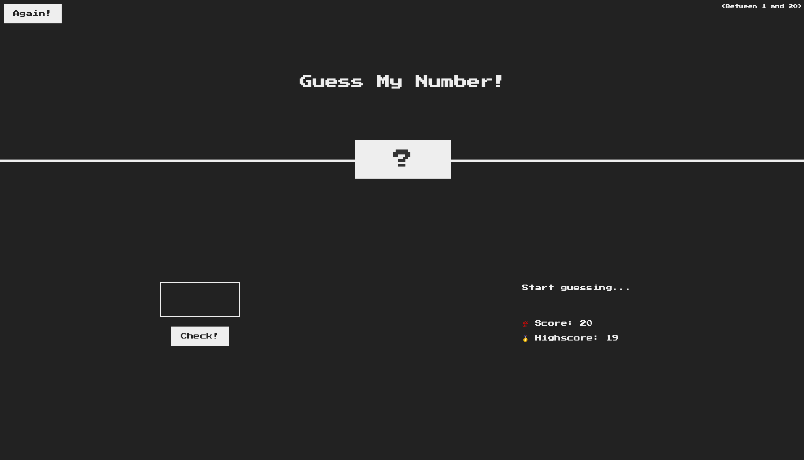
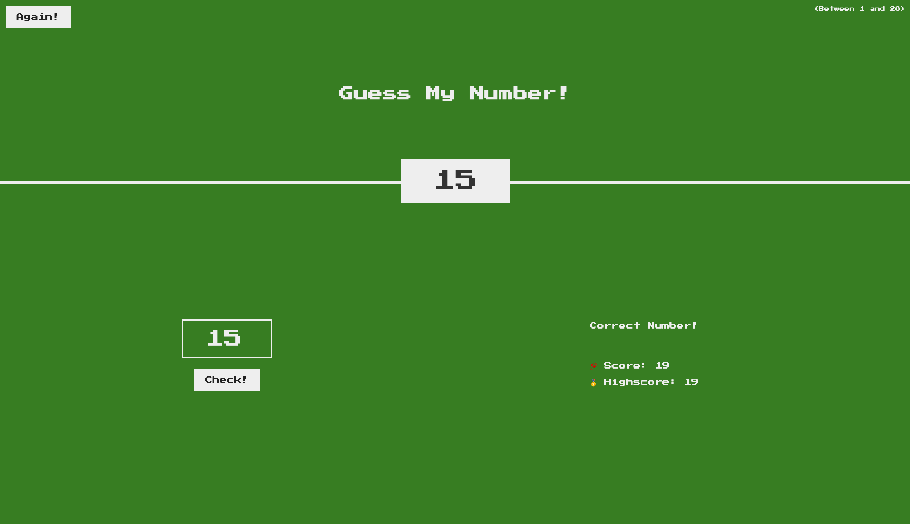

# Guess My Number

     document.querySelector('.number').style.width  = '30rem';   --- width
     document.querySelector('body').style.backgroundColor = '#222';   ---- backgroundColor
     document.querySelector('.number').textContent = random_no;
     

